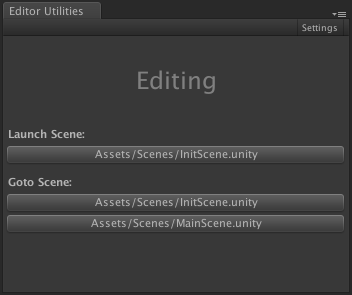
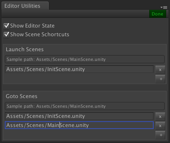

# Unity Editor Utilities
Small editor extension to help you in everyday Unity development.

Extension was created to solve two problems:

- **Problem 1**: Unity editor provides only small rotating crown in lower left corner to indicate when script compilation is in progress. **Solution**: plugin has a big label that indicates current editor state (e.g. Editing/Compiling/Running/Paused).

- **Problem 2**: if you game has "init" scene that should be launched before any other it's very inconvenient to search for it if you're working with other scenes. **Solution**: extension allows to create shortcuts to go to or launch any scene.

### Usage
To add the extension to your project:

1. [Download](https://github.com/zasadnyy/unity-editor-utilities/raw/master/EditorUtilities.unitypackage) `EditorUtilities.unitypackage`
2. Import it to your project, go to `Assets → Import Package → Custom Package…` 

### Screenshots

### Changelog

##### v.0.1
- initial release

### Licence
Project is published under the [MIT license](https://github.com/zasadnyy/unity-editor-utilities/blob/master/LICENSE). Feel free to clone and modify repo as you want, but don't forget to add a reference to the author :)

