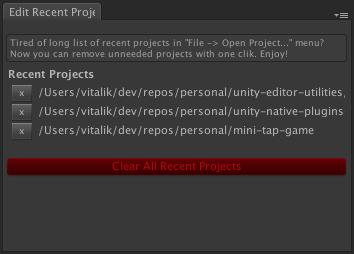

# Unity Editor Utilities

Set of editor extensions to show current editor state, create working scene shortcuts and edit recent projects list.

**[Get it on Unity Asset Store](https://www.assetstore.unity3d.com/en/#!/content/37101)**

### Features

- **Huge editor state indicator**. Unity editor provides only small rotating crown in lower right corner to indicate when script compilation is in progress. Plugin has a big label that indicates current editor state (e.g. Editing/Compiling/Running/Paused).

- **Scene shortcuts**. If you game has "init" scene that should be launched before any other it's very inconvenient to search for it if you're working with other scenes. Extension allows to create shortcuts to go to or launch any scene.

- **Recent projects editor**. Tired of long list of recent projects in `File -> Open Project...` popup? Now you can remove unneeded projects with one click.

### Usage

To add the extension to your project:

1. [Download](https://github.com/zasadnyy/unity-editor-utilities/raw/master/EditorUtilities.unitypackage) `EditorUtilities.unitypackage`
2. Import it to your project, go to `Assets → Import Package → Custom Package…` 
3.  Open editor extensions via `Window → Editor Utilities` or `Window → Edit Recent Projects` menu options

### Screenshots

### Changelog

##### v.0.3
- Horray! New tool `Window → Edit Recent Projects`

##### v.0.2
- Added basic scene path validation
- Fixed [issue #1](https://github.com/zasadnyy/unity-editor-utilities/issues/1): now copy/paste handled correctly
- Fixed [issue #2](https://github.com/zasadnyy/unity-editor-utilities/issues/2): now scenes added with template `Assets/Scenes/` path

##### v.0.1
- Initial release

### Licence
The project is published under the [MIT license](https://github.com/zasadnyy/unity-editor-utilities/blob/master/LICENSE). Feel free to clone and modify repo as you want, but don't forget to add a reference to the author :)

